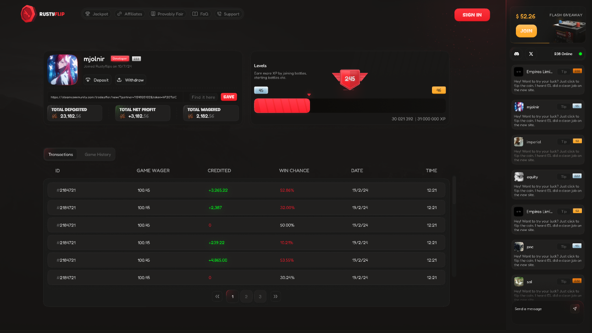

## **RustyFlip**  
RustyFlip is a cutting-edge, blockchain-powered gaming platform inspired by the classic RustyPot experience. It leverages Web3 technologies to provide users with secure, transparent, and engaging gaming features, including customizable coinflip matches, tiered jackpot rooms, progressive jackpots, and cryptocurrency staking.  
  

---

### **Table of Contents**  

1. [Installation](#installation)  
2. [Usage](#usage)  
3. [Contributing](#contributing)  
4. [Demo](#demo)   

---

### **Technological Stack**  
- **Backend**: Node.js  
- **Frontend**: Next.js  
- **Database**: MongoDB  
- **Smart Contracts**: Solidity  

---

### **Installation**  

#### **Prerequisites**  
Ensure you have the following installed:  
- [Node.js](https://nodejs.org/)  
- [npm](https://www.npmjs.com/) or [yarn](https://yarnpkg.com/)  
- [MongoDB](https://www.mongodb.com/)  

#### **Steps**  

1. Set up Node version:  
   ```bash  
   Node version = 18
   ``` 

2. Clone the repository:  
   ```bash  
   git clone https://github.com/test-project000/rustyflip1.24     
   cd rustyflip1.24
   ```  

3. Install dependencies:  
   ```bash  
   npm install  
   ```   

4. Start the development server:  
   ```bash  
   npm run dev  
   ```  

---

### **Usage**  
Once the development server is running:  
- Access the platform at `http://localhost:3000`.  
- Interact with features like coinflip, jackpot rooms, and staking rewards.  

---

### **Contributing**  
We welcome contributions! Follow these steps:  
1. Fork the repository.  
2. Create a new feature branch:  
   ```bash  
   git checkout -b feature/your-feature  
   ```  
3. Commit your changes:  
   ```bash  
   git commit -m "Add your feature"  
   ```  
4. Push to the branch:  
   ```bash  
   git push origin feature/your-feature  
   ```  
5. Create a pull request.  

---

### **Demo**

- Next Version : https://www.rustyflip.com/